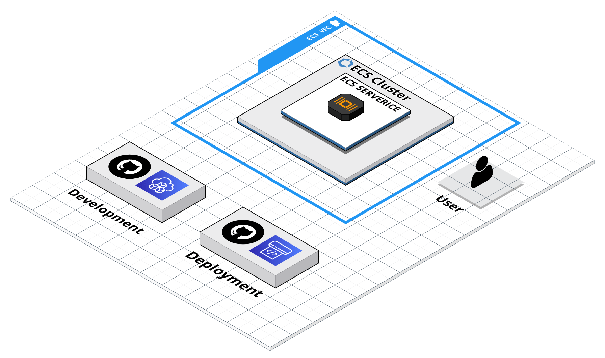
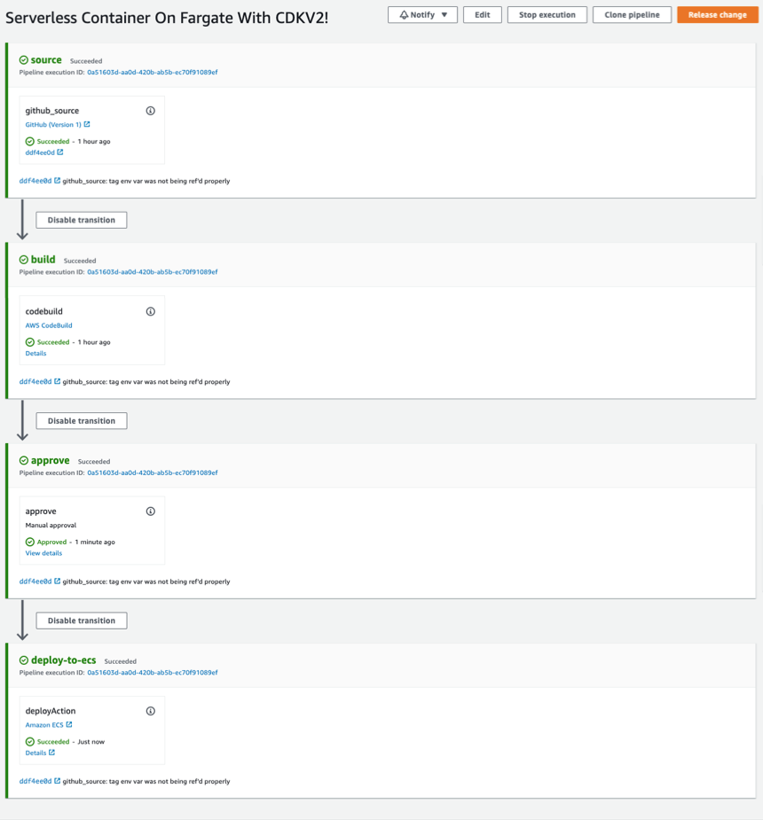

# CDK CI/CD Stack - Fargate




This repository contains the code required to deploy a containerized workload to ecs using fargate. It uses a github access token stored in AWS Key Managment Service to trigger builds based webhooks from github.com


The infrastructure code will build a pipeline with 4 stages, as shown below. After the first infrastructure deploy, the container that holds the webapp can be developed and built for production independently.

The build steps:




There is one piece of manual setup that needs to occur before the first deploy. The setup invovles creating a github PAT, and storing it in the AWS key managment service. 

The name of the KMS Token is used as a deploy time argument so its advised to name it something easy to remember. The convention most people chose to use is: `/<github_org_or_user>/<repo_name>/github/personal_access_token`

Once the intial setup is complete, any pushes to the master branch of the respository that holds this code will result in the build pipeline being triggered, which rebuilds the container thats defined in `node-app/Dockefile`, tags this new container with latest, and incrementally rolls the changes out to ecs assuming they pass health checks. 

If they dont, ecs will not complete the rollout of the new tag, and will keep the previous tagged version as whats running in production. What happens after that is left to the user of this repository as its a business decision. 

## Setup

As mentioned above, there are two steps that need to be completed manually before you run `cdk deploy` for the first time. 

At a high level, they are summarized as such:

1. Create a Github repository for this code to live in. 
2. Create a Github personal access token with the scopes mentioned below. The purpose of the PAT is to allow ECS to listen to webhooks so it can rebuild and deploy the container on pushes to master/main. 
3. Store the Github PAT created in step 2 in the AWS Key managment service so the plaintext version of the token does not ever have stored in the codebase, or anywhere thats less than secure. The only thing required to know is its name, the rest is handled with IAM. 

**Note:** All of the setup steps assume you have a recent version of the aws cli configured on the machine you are working on, with the properly scoped permissions to complete the steps. See [setup on the aws website](https://docs.aws.amazon.com/cli/latest/userguide/getting-started-install.html) for help if you do not have this setup. 

### Step 1: Create Github Token

Using the Github website, navigate to Settings/Developer Settings/Personal access tokens, create a new token with the following permissions:


**admin:repo_hook**   
**admin:org_hook**   
**repo**  

If you are currently logged into github, you You may follow this link to create a token with the correct scopes pre-populated
```bash
https://github.com/settings/tokens/new?scopes=repo,admin:repo_hook,admin:org_hook&description=cdk-cistack
```

### Step Two: Store Github Token In AWS Key Managment Service
To change the secret name, make the proper subsititions below,and then specify the optional githubTokenSecretName parameter during the cdk deploy step.

** Note, ensure the AWS_REGION env variable is set in your current shell with `echo $AWS_REGION`. If you get a blank line back, either hardcode the value before running the cli command, or set it. 

```bash
aws configure set region $AWS_REGION
aws secretsmanager create-secret \
 --name <SECRET_NAME> \
 --secret-string <GITHUB_TOKEN>
 ```

Once the above command is run, check if the secret is stored as expected using below command:


 ```
 aws secretsmanager get-secret-value \
    --secret-id <SECRET_NAME> \
    --version-stage AWSCURRENT
```

### Authorize CodeBuild
It is neccessary to authorize code build to create the hook in Github which will trigger deployments through your Code Pipeline. Replace with your GitHub Personal Access Token in the following snippet and run the following in you development environment.

``` 
aws codebuild import-source-credentials \
    --server-type GITHUB \
    --auth-type PERSONAL_ACCESS_TOKEN \
    --token <GITHUB_TOKEN>
```
Verify the credential import worked.

```
aws codebuild list-source-credentials 
```

With these steps complete, you can now launch the infrastructure. The rest of the readme outlines these steps. 

### Launch infrastructure 
```
cd infra
npm install
npm run build
```

Depending on the AWS account you're deploying to, you may also need to run these commands:
```
cdk ls
cdk bootstrap aws://$AWS_ACCOUNT/$AWS_REGION
```

### Deploy Stack

First, synthesize the cloudformation template to build the cloudformation template (if first deploy), or build and capture cloudformation diff (subsequent deploys):

```
cdk synth
``` 

Finally, deploy the stack passing in the appropriate CfnParameter defined in `ecs-cdk-stack.ts`, as well as the stack name as a context param (optional)

```
cdk deploy \
    --parameters githubUserName=<myGithubUserName> \
    --parameters githubPersonalTokenSecretName="<myGithubPersonalTokenSecretName>" \
    --context stackName="<myStackName>"
```